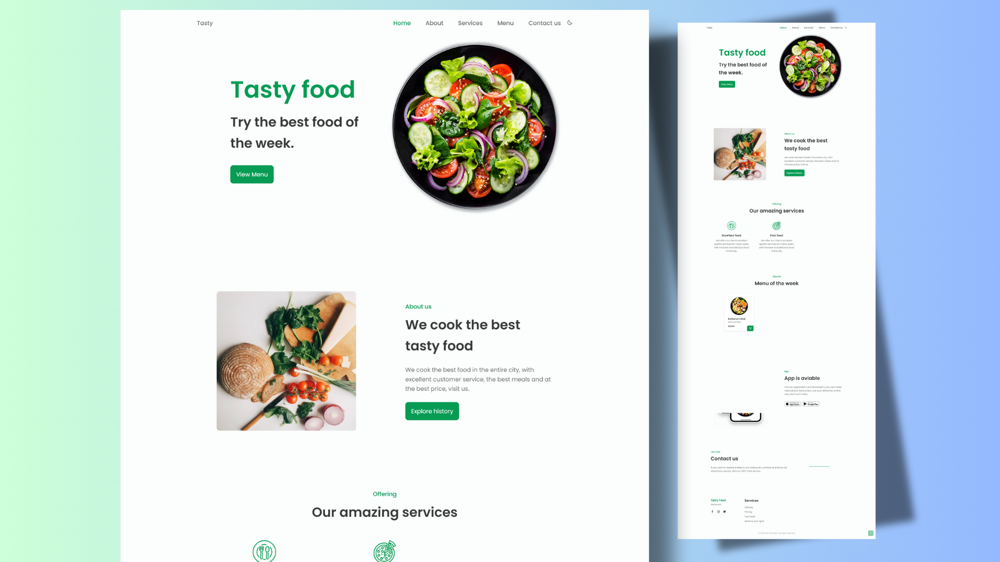

# 🍽️ Tasty Food - Responsive Restaurant Website



Welcome to **Tasty Food**, a modern and fully responsive restaurant website template. This project is perfect for restaurants, cafes, and food delivery services looking to showcase their menu, services, and contact information in a stylish and user-friendly way.

---

## 🚀 Features

- **Responsive Design:** Looks great on desktops, tablets, and mobile devices.
- **Dark/Light Theme Switcher:** Easily toggle between dark and light modes.
- **Animated Scroll Effects:** Smooth reveal animations using [ScrollReveal](https://scrollrevealjs.org/).
- **Modern UI:** Clean layout with attractive sections for Home, About, Services, Menu, App, Contact, and Footer.
- **Easy Customization:** Built with SCSS for easy style management.
- **Mobile Navigation:** Hamburger menu for seamless mobile experience.

---

## 📂 Project Structure

```
index.html
preview.png
assets/
  css/
    styles.css
  js/
    main.js
  scss/
    styles.scss
  img/
    ... (images)
```

---

## 🛠️ Getting Started

1. **Clone or Download** this repository.
2. Open `index.html` in your browser to view the website.
3. Customize images and content in the `assets/img/` and `index.html` as needed.
4. Edit styles in `assets/scss/styles.scss` and compile to `assets/css/styles.css` for advanced customization.

---

## 📸 Preview


---

## 📱 Live Demo

> _You can deploy this project on [Netlify](https://www.netlify.com/), [Vercel](https://vercel.com/), or any static hosting provider._

---

## 📝 License

This project is licensed under the [GNU GPL v3](LICENSE).

---

## 🙌 Credits

- Design and code by **Md Asif Islam**
- Inspired by modern restaurant UI trends

---

Enjoy your delicious new website! 🍕🍔🥗